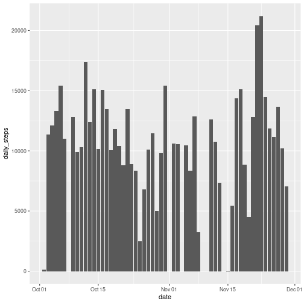
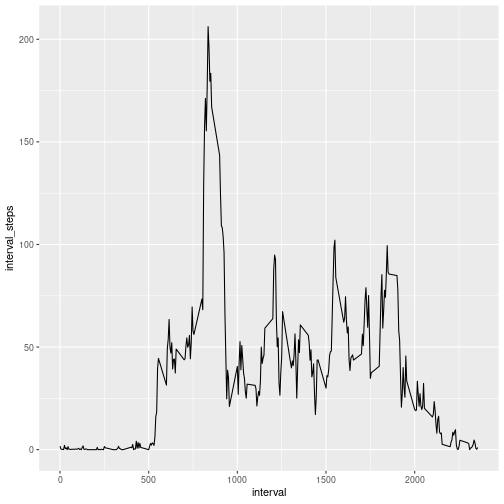
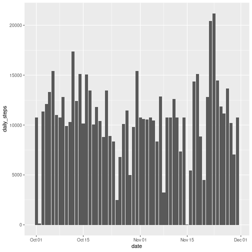
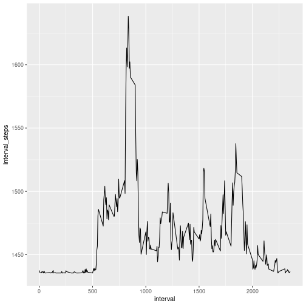
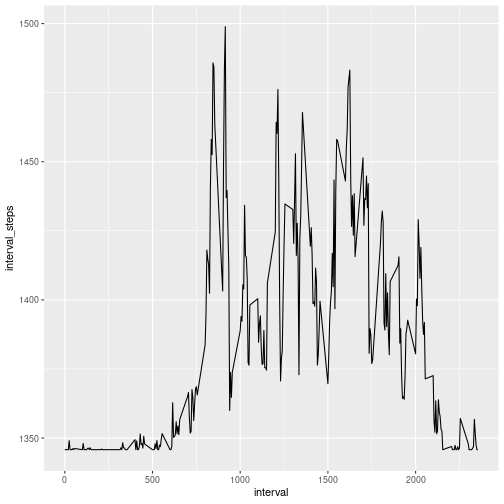

#Peer-graded Assignment: Course Project 1

##First step: Create the dataset

This segment has the code for reading in the dataset and processing the data.


```r
library(readr)
library(knitr)
activity <- read_csv("activity.csv")
```

```
## Parsed with column specification:
## cols(
##   steps = col_double(),
##   date = col_date(format = ""),
##   interval = col_double()
## )
```

```r
str(activity)
```

```
## tibble [17,568 × 3] (S3: spec_tbl_df/tbl_df/tbl/data.frame)
##  $ steps   : num [1:17568] NA NA NA NA NA NA NA NA NA NA ...
##  $ date    : Date[1:17568], format: "2012-10-01" "2012-10-01" "2012-10-01" "2012-10-01" ...
##  $ interval: num [1:17568] 0 5 10 15 20 25 30 35 40 45 ...
##  - attr(*, "spec")=
##   .. cols(
##   ..   steps = col_double(),
##   ..   date = col_date(format = ""),
##   ..   interval = col_double()
##   .. )
```

## Second step: Summary statistics for the data

What is the mean and median of total number of steps taken per day?


```r
library(dplyr)
activity_daily <- activity %>%
                    group_by(date) %>%
                    summarise(daily_steps = sum(steps))
```

```
## `summarise()` ungrouping output (override with `.groups` argument)
```

```r
summary(activity_daily)
```

```
##       date             daily_steps   
##  Min.   :2012-10-01   Min.   :   41  
##  1st Qu.:2012-10-16   1st Qu.: 8841  
##  Median :2012-10-31   Median :10765  
##  Mean   :2012-10-31   Mean   :10766  
##  3rd Qu.:2012-11-15   3rd Qu.:13294  
##  Max.   :2012-11-30   Max.   :21194  
##                       NA's   :8
```

```r
mean_daily <- mean(activity_daily$daily_steps, na.rm=TRUE)
median_daily <- median(activity_daily$daily_steps, na.rm=TRUE)
```

The mean of the total number of steps taken per day is `mean_daily`.
The median of the total number of steps taken per day is `median_daily`.

And here is the histogram:


```r
library(ggplot2)
ggplot(activity_daily, aes(x=date, y=daily_steps)) + geom_bar(stat='identity')
```

```
## Warning: Removed 8 rows containing missing values (position_stack).
```



And here is a plot with the daily activity pattern:


```r
activity_avgday <- activity %>%
                    group_by(interval) %>%
                    summarise(interval_steps = mean(steps, na.rm = TRUE))
```

```
## `summarise()` ungrouping output (override with `.groups` argument)
```

```r
ggplot(activity_avgday, mapping = aes(x = interval, y = interval_steps)) + geom_line()
```




##Third step: Inputing missing values

Here we diagnose the missing values problem and create a new dataset that is equal to the original dataset but with the missing data filled in.


```r
count_NAs <- sum(is.na(activity_daily$daily_steps))
```

There exist `count_NAs` missing values.
To fix the issue, we will input mean values where there is a missing value.
Afterwards, we calculate the mean, median and plot an histogram.


```r
library(tidyr)
activity_daily2 <- activity_daily %>%
                    replace_na(list(daily_steps=mean_daily))
```


```r
summary(activity_daily2)
```

```
##       date             daily_steps   
##  Min.   :2012-10-01   Min.   :   41  
##  1st Qu.:2012-10-16   1st Qu.: 9819  
##  Median :2012-10-31   Median :10766  
##  Mean   :2012-10-31   Mean   :10766  
##  3rd Qu.:2012-11-15   3rd Qu.:12811  
##  Max.   :2012-11-30   Max.   :21194
```

```r
mean_daily_2 <- mean(activity_daily2$daily_steps, na.rm=TRUE)
median_daily_2 <- median(activity_daily2$daily_steps, na.rm=TRUE)

ggplot(activity_daily2, aes(x=date, y=daily_steps)) + geom_bar(stat='identity')
```



In sum: the strategy used for removing the NAs did not impact the mean but it impacted the median.
- New mean is `mean_daily_2` same as old mean (`mean_daily`)
- New median is `median_daily_2` different from old median (`median_daily`)


##Fourth step: Activity patterns in weekdays vs weekends

Create the new dataset: 


```r
activity2 <- activity %>%
                    replace_na(list(steps=mean_daily)) %>%
                    mutate(weekday = weekdays(date),
                           weekday_dummy = ifelse(weekday == "Saturday" | weekday == "Sunday", "Weekend", "Weekday"))
activity2$weekday_dummy <- factor(activity2$weekday_dummy)

str(activity2)
```

```
## tibble [17,568 × 5] (S3: spec_tbl_df/tbl_df/tbl/data.frame)
##  $ steps        : num [1:17568] 10766 10766 10766 10766 10766 ...
##  $ date         : Date[1:17568], format: "2012-10-01" "2012-10-01" "2012-10-01" "2012-10-01" ...
##  $ interval     : num [1:17568] 0 5 10 15 20 25 30 35 40 45 ...
##  $ weekday      : chr [1:17568] "Monday" "Monday" "Monday" "Monday" ...
##  $ weekday_dummy: Factor w/ 2 levels "Weekday","Weekend": 1 1 1 1 1 1 1 1 1 1 ...
##  - attr(*, "spec")=
##   .. cols(
##   ..   steps = col_double(),
##   ..   date = col_date(format = ""),
##   ..   interval = col_double()
##   .. )
```

Plot the 5-minute interval (x-axis) and the average number of steps taken, averaged across all weekday days or weekend days (y-axis).


```r
activity_avgweekday <- activity2 %>%
                    filter(weekday_dummy == "Weekday") %>%
                    group_by(interval) %>%
                    summarise(interval_steps = mean(steps, na.rm = TRUE))
```

```
## `summarise()` ungrouping output (override with `.groups` argument)
```

```r
ggplot(activity_avgweekday, mapping = aes(x = interval, y = interval_steps)) + 
  geom_line()
```



```r
activity_avgweekend <- activity2 %>%
                    filter(weekday_dummy == "Weekend") %>%
                    group_by(interval) %>%
                    summarise(interval_steps = mean(steps, na.rm = TRUE))
```

```
## `summarise()` ungrouping output (override with `.groups` argument)
```

```r
ggplot(activity_avgweekend, mapping = aes(x = interval, y = interval_steps)) + 
  geom_line()
```


